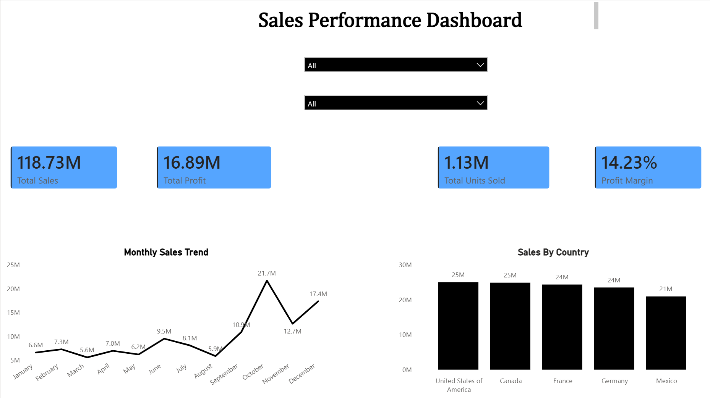
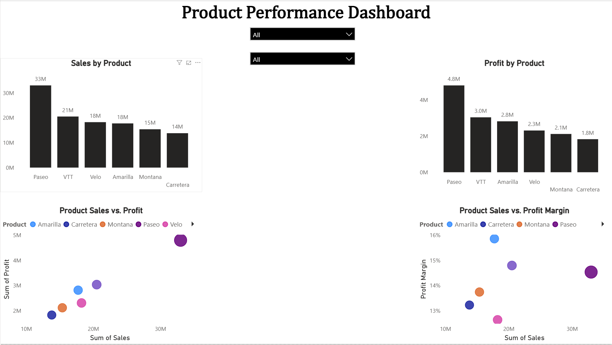
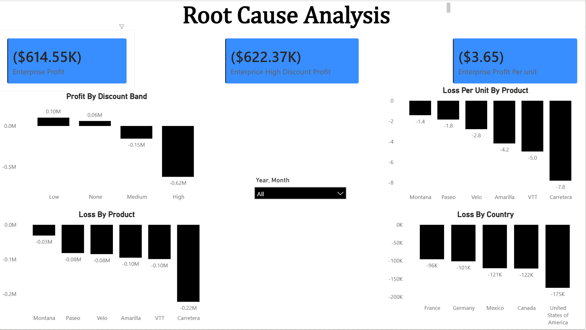

# 📊 Sales Performance Analysis

## Project Overview

This project analyzes sales performance using SQL and Power BI.

The objective is to identify sales trends, investigate the root cause of Enterprise losses, and provide actionable business recommendations.

---

## Tools

- SQL (MySQL)
- Power BI
- Excel
- GitHub

---

## Dashboard Preview
## Executive Dashboard

## Product Performance

## Root Cause Analysis

## Key Findings

- Enterprise generated a total loss of **$614.55K**.
- High Discount accounted for nearly all Enterprise losses.
- Carretera generated the largest product loss.
- The United States reported the highest Enterprise loss.
- Enterprise lost approximately **$3.65 per unit sold**.

## Business Recommendations

- Reduce the High Discount strategy for Enterprise customers.
- Review Carretera's pricing strategy.
- Monitor Profit per Unit as a key performance indicator.
- Reassess Enterprise discount policies to improve profitability.
